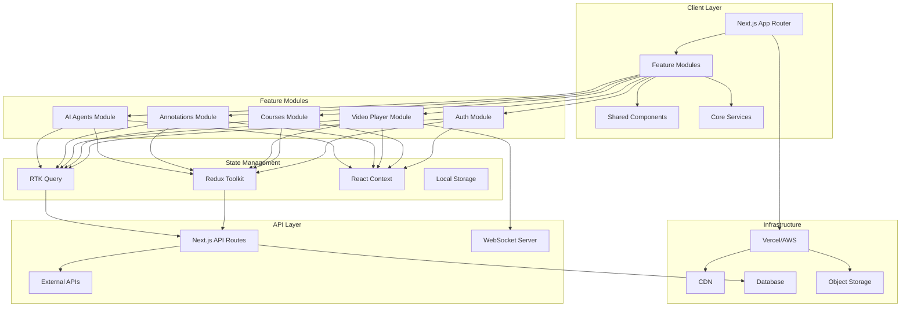
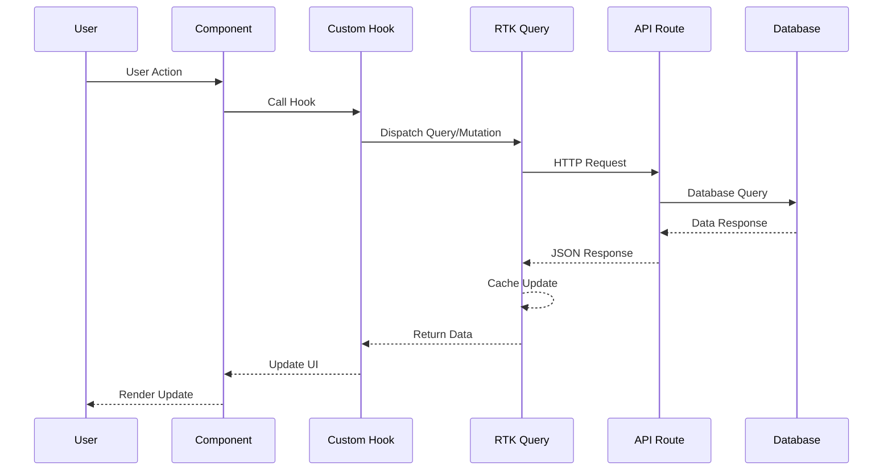
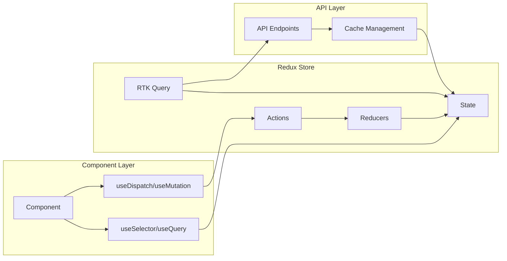
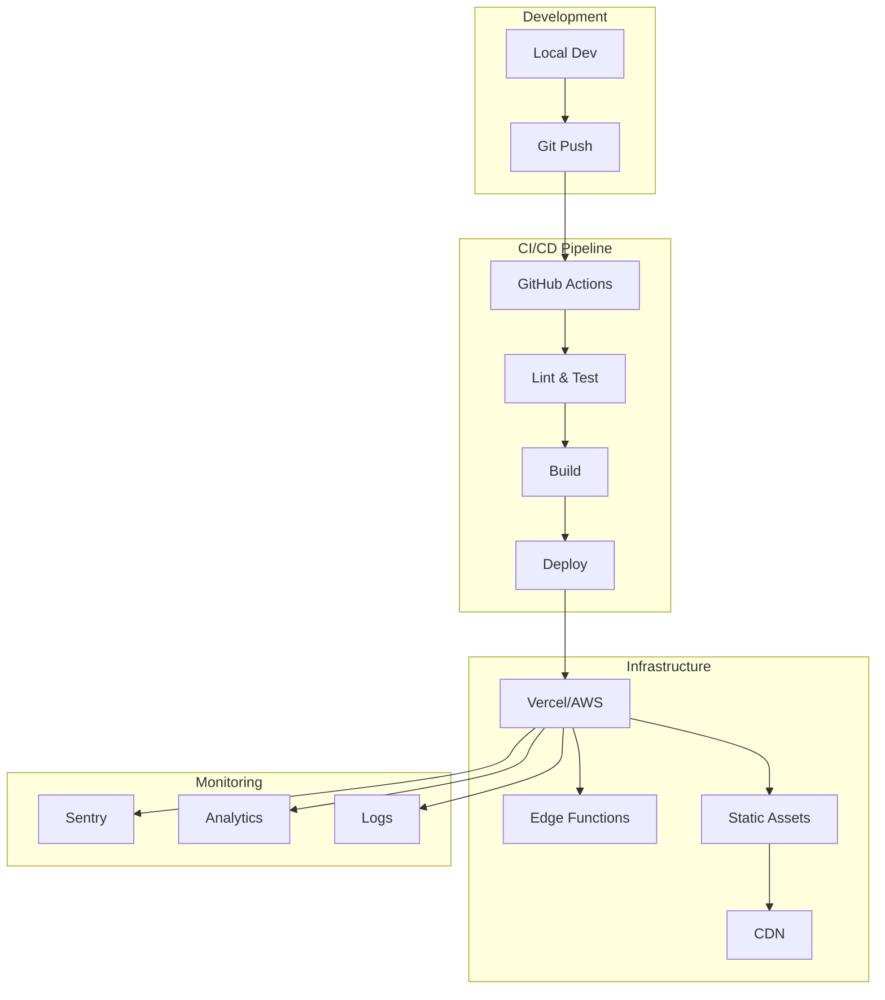

# 🏗️ Unpuzzle Architecture Diagram

## System Architecture Overview



## Component Architecture

```
┌─────────────────────────────────────────────────────────────────┐
│                         App Router Layout                        │
├─────────────────────────────────────────────────────────────────┤
│                                                                  │
│  ┌──────────────┐  ┌──────────────┐  ┌────────────────────┐   │
│  │              │  │              │  │                    │   │
│  │   (auth)     │  │ (dashboard)  │  │    (learning)      │   │
│  │   Routes     │  │   Routes     │  │     Routes         │   │
│  │              │  │              │  │                    │   │
│  └──────┬───────┘  └──────┬───────┘  └─────────┬──────────┘   │
│         │                  │                     │               │
│         └──────────────────┴─────────────────────┘               │
│                            │                                     │
│                     ┌──────▼───────┐                            │
│                     │              │                            │
│                     │   Features   │                            │
│                     │              │                            │
│                     └──────┬───────┘                            │
│                            │                                     │
│      ┌─────────────────────┼─────────────────────┐              │
│      │                     │                     │              │
│  ┌───▼────┐  ┌────────┐  ┌▼────────┐  ┌────────▼───┐          │
│  │ Auth   │  │Courses │  │ Video   │  │Annotations │          │
│  │Feature │  │Feature │  │ Player  │  │  Feature   │          │
│  └────────┘  └────────┘  └─────────┘  └────────────┘          │
│                                                                  │
└─────────────────────────────────────────────────────────────────┘
```

## Data Flow Architecture



## Performance Architecture

```
┌─────────────────────────────────────────────────────────────┐
│                    Performance Optimization                  │
├─────────────────────────────────────────────────────────────┤
│                                                             │
│  Build Time                    Runtime                      │
│  ┌─────────────┐             ┌─────────────┐              │
│  │ Tree Shake  │             │ Lazy Load   │              │
│  │ Dead Code   │             │ Components  │              │
│  │ Elimination │             └─────────────┘              │
│  └─────────────┘                                          │
│                               ┌─────────────┐              │
│  ┌─────────────┐             │   React     │              │
│  │ Bundle      │             │   Memo &    │              │
│  │ Splitting   │             │  useCallback │              │
│  └─────────────┘             └─────────────┘              │
│                                                            │
│  ┌─────────────┐             ┌─────────────┐              │
│  │   Image     │             │   Request   │              │
│  │ Optimization│             │   Caching   │              │
│  └─────────────┘             └─────────────┘              │
│                                                            │
│  ┌─────────────┐             ┌─────────────┐              │
│  │    CSS      │             │  Virtualize │              │
│  │  Modules    │             │  Long Lists │              │
│  └─────────────┘             └─────────────┘              │
└─────────────────────────────────────────────────────────────┘
```

## Folder Structure Visualization

```
src/
├── 📁 app/                    [Next.js App Router]
│   ├── 📁 (auth)/            [Auth Layout Group]
│   ├── 📁 (dashboard)/       [Dashboard Layout Group]
│   └── 📁 (learning)/        [Learning Layout Group]
│
├── 📁 features/              [Feature-based Modules]
│   ├── 📁 auth/
│   │   ├── 📁 components/
│   │   ├── 📁 hooks/
│   │   ├── 📁 services/
│   │   ├── 📁 store/
│   │   └── 📁 types/
│   │
│   ├── 📁 courses/
│   │   └── [Same structure]
│   │
│   └── 📁 video-player/
│       └── [Same structure]
│
├── 📁 shared/                [Shared Resources]
│   ├── 📁 components/
│   │   ├── 📁 ui/           [Primitive Components]
│   │   ├── 📁 layouts/      [Layout Components]
│   │   └── 📁 feedback/     [Feedback Components]
│   │
│   ├── 📁 hooks/            [Shared Hooks]
│   ├── 📁 utils/            [Utilities]
│   └── 📁 types/            [Shared Types]
│
└── 📁 core/                 [Core Setup]
    ├── 📁 config/           [App Configuration]
    ├── 📁 providers/        [Context Providers]
    ├── 📁 store/            [Redux Store]
    └── 📁 lib/              [External Libraries]
```

## State Management Flow



## Security Architecture

```
┌─────────────────────────────────────────────────────────────┐
│                     Security Layers                          │
├─────────────────────────────────────────────────────────────┤
│                                                             │
│  Frontend                          Backend                  │
│  ┌─────────────┐                  ┌─────────────┐         │
│  │   Clerk     │                  │    API      │         │
│  │   Auth      │◄────────────────►│   Routes    │         │
│  └─────────────┘                  └──────┬──────┘         │
│                                           │                 │
│  ┌─────────────┐                  ┌──────▼──────┐         │
│  │   Input     │                  │ Middleware   │         │
│  │ Validation  │                  │ Validation   │         │
│  └─────────────┘                  └──────┬──────┘         │
│                                           │                 │
│  ┌─────────────┐                  ┌──────▼──────┐         │
│  │   Content   │                  │    Rate      │         │
│  │  Security   │                  │  Limiting    │         │
│  │   Policy    │                  └──────┬──────┘         │
│  └─────────────┘                         │                 │
│                                   ┌──────▼──────┐         │
│                                   │   Database   │         │
│                                   │  Encryption  │         │
│                                   └─────────────┘         │
└─────────────────────────────────────────────────────────────┘
```

## Deployment Architecture



## Performance Monitoring Dashboard

```
┌─────────────────────────────────────────────────────────────┐
│                 Performance Metrics Dashboard                │
├─────────────────────────────────────────────────────────────┤
│                                                             │
│  ┌─────────────┐  ┌─────────────┐  ┌─────────────┐       │
│  │    LCP      │  │    FID      │  │    CLS      │       │
│  │  < 2.5s     │  │  < 100ms    │  │  < 0.1      │       │
│  │    ✅       │  │     ✅      │  │     ✅      │       │
│  └─────────────┘  └─────────────┘  └─────────────┘       │
│                                                             │
│  ┌─────────────┐  ┌─────────────┐  ┌─────────────┐       │
│  │   Bundle    │  │   Memory    │  │    API      │       │
│  │   < 300KB   │  │   < 50MB    │  │  < 200ms    │       │
│  │     ✅      │  │     ✅      │  │     ✅      │       │
│  └─────────────┘  └─────────────┘  └─────────────┘       │
│                                                             │
│  ┌──────────────────────────────────────────────────┐      │
│  │              Real-time Performance Graph          │      │
│  │    100 ┤                                         │      │
│  │     90 ┤        ╱╲    ╱╲                        │      │
│  │     80 ┤    ╱╲╱  ╲╱╲╱  ╲╱╲                    │      │
│  │     70 ┤╱╲╱╲            ╲╱╲╱╲╱               │      │
│  │     60 ┤                                       │      │
│  └──────────────────────────────────────────────────┘      │
└─────────────────────────────────────────────────────────────┘
```

This architecture ensures:
- **Scalability**: Modular design allows easy feature additions
- **Performance**: Optimized bundle sizes and runtime efficiency
- **Maintainability**: Clear separation of concerns
- **Type Safety**: Full TypeScript coverage
- **Testing**: Comprehensive test coverage
- **Security**: Multiple layers of protection
- **Monitoring**: Real-time performance tracking