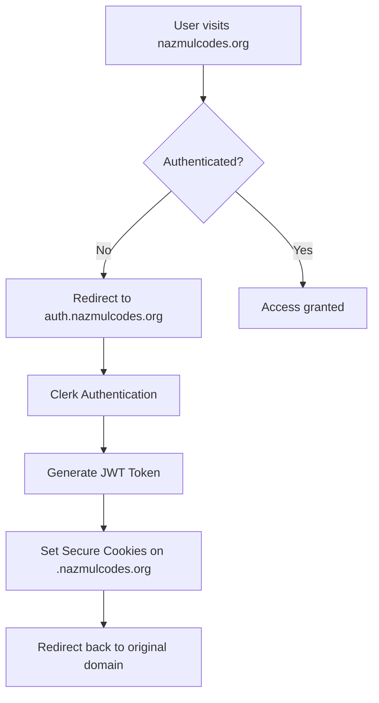

# Cross-Origin Authentication Strategy

## Overview
This document outlines the authentication strategy for managing user sessions across multiple subdomains and origins in the Unpuzzle platform.

## Current Setup
- **Student App**: `nazmulcodes.org` 
- **Backend API**: `dev.nazmulcodes.org`
- **Instructor App**: `instructor.nazmulcodes.org`
- **Auth Provider**: Clerk + Custom JWT

## Architecture Strategy: Centralized Authentication Hub

### 1. Authentication Flow



### 2. Implementation Components

#### A. Authentication Microservice
- **Endpoint**: `auth.nazmulcodes.org`
- **Purpose**: Centralized authentication handling
- **Features**:
  - Clerk integration
  - JWT token generation
  - Cross-domain cookie management
  - Session validation

#### B. Shared Cookie Strategy
- **Domain**: `.nazmulcodes.org` (wildcard for all subdomains)
- **Cookies**:
  - `__auth_token`: JWT with user data
  - `__auth_session`: Session identifier
  - `__auth_refresh`: Refresh token

#### C. Token Validation Middleware
- Validate tokens on each subdomain
- Handle token refresh automatically
- Provide user context to applications

### 3. Security Considerations

#### Cookie Configuration
```javascript
{
  domain: '.nazmulcodes.org',
  httpOnly: true,
  secure: true,
  sameSite: 'lax',
  maxAge: 24 * 60 * 60 * 1000 // 24 hours
}
```

#### CORS Configuration
- Allow credentials for all subdomains
- Strict origin validation
- Secure headers enforcement

### 4. Implementation Steps

#### Step 1: Create Authentication Service
1. Set up `auth.nazmulcodes.org` subdomain
2. Deploy authentication microservice
3. Configure Clerk for multiple domains

#### Step 2: Update Cookie Strategy
1. Modify cookie domain to `.nazmulcodes.org`
2. Implement secure cookie sharing
3. Add token refresh mechanism

#### Step 3: Cross-Domain Session Management
1. Create session synchronization
2. Implement logout across all domains
3. Handle token expiration gracefully

#### Step 4: Frontend Integration
1. Update authentication checks
2. Implement automatic token refresh
3. Handle cross-domain redirects

### 5. Alternative Approaches

#### Option A: PostMessage API
- Use iframe communication for token sharing
- More complex but avoids cookie limitations
- Good for third-party domain integration

#### Option B: Shared Local Storage
- Use localStorage with postMessage
- Requires careful implementation
- Not suitable for server-side rendering

#### Option C: Single Sign-On (SSO) Flow
- Implement OAuth2-like flow between domains
- Most secure but complex
- Best for enterprise-level security

## Recommended Implementation

For your current setup, **Centralized Authentication Hub** is the best approach because:

1. **Simplicity**: Leverages existing Clerk setup
2. **Security**: Maintains secure cookie practices
3. **Scalability**: Easy to add new subdomains
4. **Performance**: Minimal overhead
5. **Compatibility**: Works with your Vercel rewrites

## Next Steps

1. Set up `auth.nazmulcodes.org` subdomain
2. Implement shared cookie strategy
3. Update CORS configuration
4. Test authentication flow
5. Deploy and monitor

## Code Examples

### Updated Cookie Configuration
```typescript
// Set authentication cookie for all subdomains
res.cookie("__atrj", token, {
  domain: '.nazmulcodes.org',
  httpOnly: true,
  secure: process.env.NODE_ENV === 'production',
  sameSite: 'lax',
  maxAge: 24 * 60 * 60 * 1000
});
```

### CORS Configuration for Authentication
```typescript
const corsOptions = {
  origin: [
    'https://nazmulcodes.org',
    'https://instructor.nazmulcodes.org',
    'https://dev.nazmulcodes.org'
  ],
  credentials: true,
  methods: ['GET', 'POST', 'PUT', 'DELETE'],
  allowedHeaders: ['Content-Type', 'Authorization']
};
```

### Authentication Middleware
```typescript
const validateCrossDomainAuth = async (req, res, next) => {
  const token = req.cookies['__atrj'];
  if (!token) {
    return res.redirect('https://auth.nazmulcodes.org/login');
  }
  
  try {
    const user = jwt.verify(token, JWT_SECRET);
    req.user = user;
    next();
  } catch (error) {
    res.clearCookie('__atrj', { domain: '.nazmulcodes.org' });
    return res.redirect('https://auth.nazmulcodes.org/login');
  }
};
```